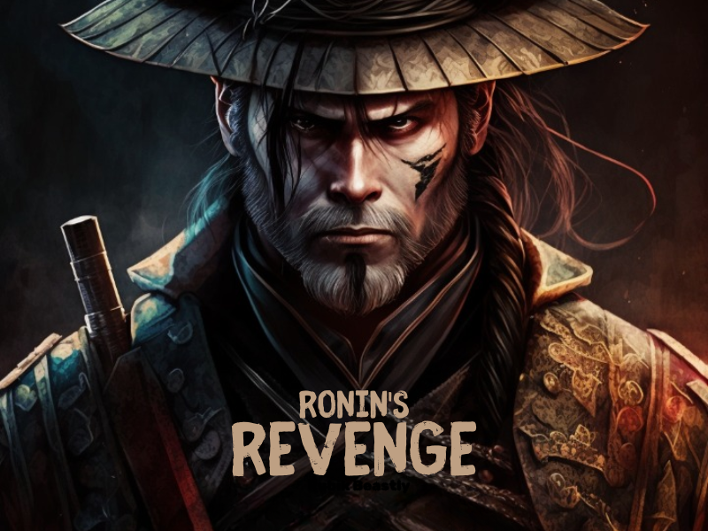

# 2022-2023-project-4-game-design-Team-3

# Ronin's Revenge

## Overview

Ronin's Revenge is a 2D platformer built on Unreal 4, where you play as a samurai seeking revenge for his betrayal. The game features fast-paced action, and a range of unique enemies.

## Installation

To install Samurai Revenge, you need to have Unreal Engine 4 installed. Then, follow these steps:

1. Download the game from [INSERT LINK HERE].
2. Extract the files to your preferred location.
3. Run the executable file.

## Controls

The controls for Samurai Revenge are as follows:

- Move left and right: Q and D keys (or arrows)
- Jump: Spacebar 
- Attack: A button
- Dash: Shift

## Functional Specification

In Ronin's Revenge, the main character can run, jump, and attacks. Enemies have unique attacks, movement patterns, and weaknesses. The game has three levels, each with a boss battle at the end.

## Technical Specification

Samurai Revenge is built on Unreal Engine 4 using Blueprint. 

## Test Plan

During testing, we encountered some minor bugs and issues, such as collision detection problems . We resolved these issues by tweaking the game's code.

## Demo

To access the demo version of Samurai Revenge, please visit [INSERT LINK HERE]. Note that the demo version only includes a few enemies and the beginning of levels.

## Credits

- Lucas AUBARD: Program Manager
- Thomas PLANCHARD: Quality Assurance
- Paul NOWAK: Technical Leader
- Karine VINETTE: Software Engineer
- Konstantinos DIMOPOULOS: Teacher of Game Design

